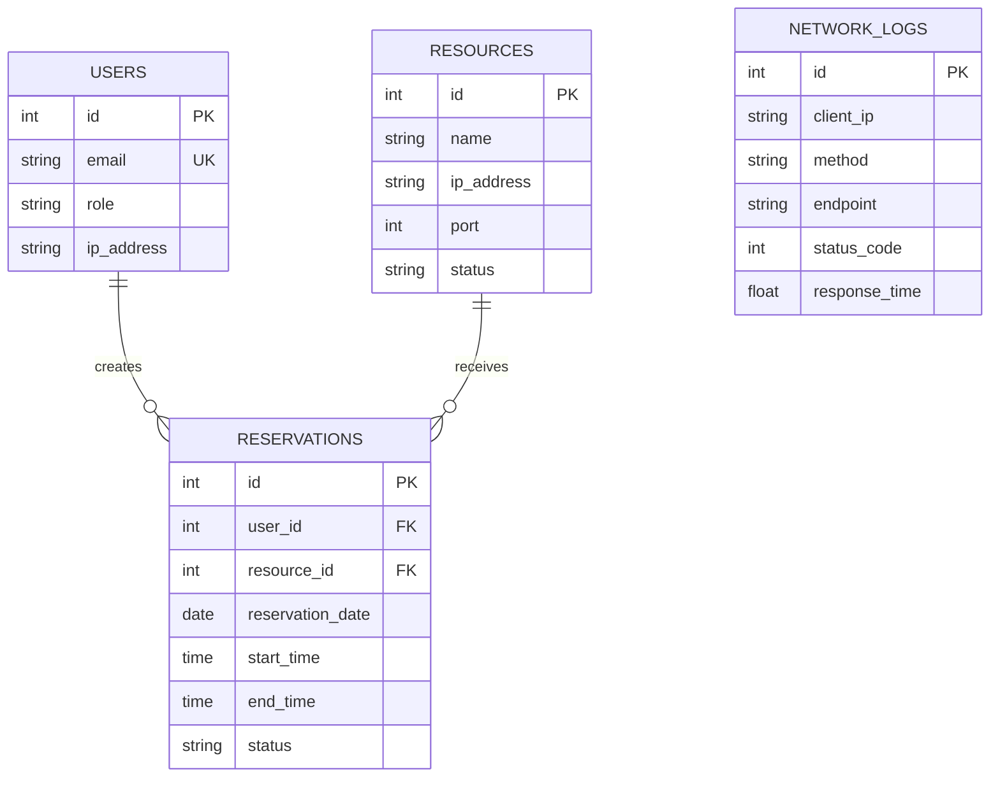
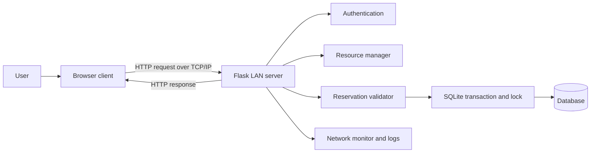
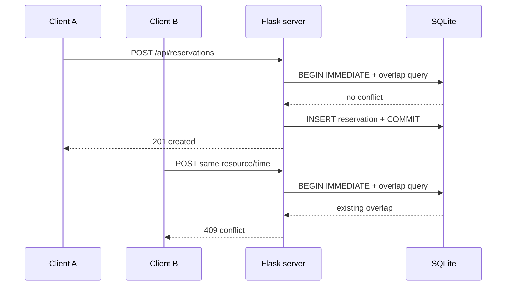
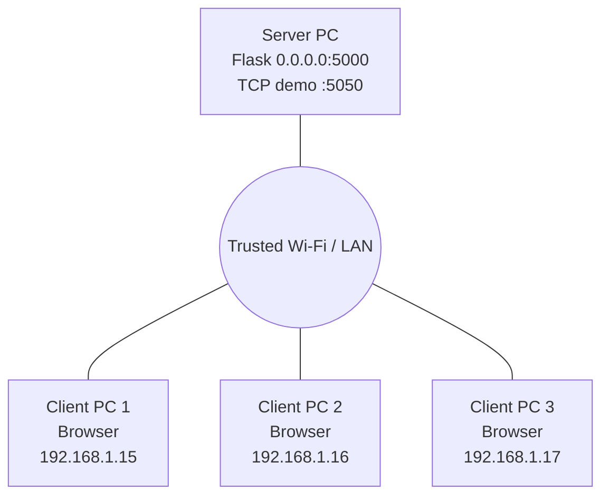

# Project diagrams

## ER diagram

```mermaid
erDiagram
    USERS ||--o{ RESERVATIONS : creates
    RESOURCES ||--o{ RESERVATIONS : receives
    USERS {
      int id PK
      string email UK
      string role
      string ip_address
    }
    RESOURCES {
      int id PK
      string name
      string ip_address
      int port
      string status
    }
    RESERVATIONS {
      int id PK
      int user_id FK
      int resource_id FK
      date reservation_date
      time start_time
      time end_time
      string status
    }
    NETWORK_LOGS {
      int id PK
      string client_ip
      string method
      string endpoint
      int status_code
      float response_time
    }
```

## Data flow diagram

```mermaid
flowchart LR
    U[User] --> B[Browser client]
    B -->|HTTP request over TCP/IP| S[Flask LAN server]
    S --> A[Authentication]
    S --> R[Resource manager]
    S --> V[Reservation validator]
    V --> L[SQLite transaction and lock]
    L --> D[(Database)]
    S --> M[Network monitor and logs]
    S -->|HTTP response| B
```

## Reservation sequence

```mermaid
sequenceDiagram
    participant A as Client A
    participant B as Client B
    participant F as Flask server
    participant DB as SQLite
    A->>F: POST /api/reservations
    F->>DB: BEGIN IMMEDIATE + overlap query
    DB-->>F: no conflict
    F->>DB: INSERT reservation + COMMIT
    F-->>A: 201 created
    B->>F: POST same resource/time
    F->>DB: BEGIN IMMEDIATE + overlap query
    DB-->>F: existing overlap
    F-->>B: 409 conflict
```

## Network architecture

```mermaid
flowchart TB
    S[Server PC\nFlask 0.0.0.0:5000\nTCP demo :5050]
    W((Trusted Wi-Fi / LAN))
    C1[Client PC 1\nBrowser\n192.168.1.15]
    C2[Client PC 2\nBrowser\n192.168.1.16]
    C3[Client PC 3\nBrowser\n192.168.1.17]
    S --- W
    W --- C1
    W --- C2
    W --- C3
```
